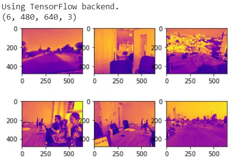
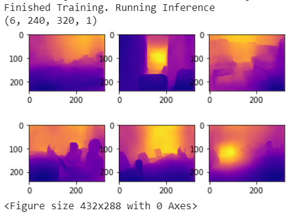

# Single Camera Depth Estimation using DenseNet169
Replicated results from DenseDepth using DenseNet169 in Python.

Ref: Original Work by Alhashim et al.

Run sketch.py to load data and start training.

Dataset: NYU-v2, more info can be found [here](https://cs.nyu.edu/~silberman/datasets/nyu_depth_v2.html)

Place the Dataset in the root directory. Download [here](https://s3-eu-west-1.amazonaws.com/densedepth/nyu_data.zip)

Sample Results: Trained on NVIDIA Tesla K80 (14GB VRAM); 3 epochs, bs 6, 4 hours

## Input 



## Output


Notice that since the distribution of input dataset belongs to indoors, it performs reasonably well on indoors. 


```
@article{Alhashim2018,
  author    = {Ibraheem Alhashim and Peter Wonka},
  title     = {High Quality Monocular Depth Estimation via Transfer Learning},
  journal   = {arXiv e-prints},
  volume    = {abs/1812.11941},
  year      = {2018},
  url       = {https://arxiv.org/abs/1812.11941},
  eid       = {arXiv:1812.11941},
  eprint    = {1812.11941}
}
```
